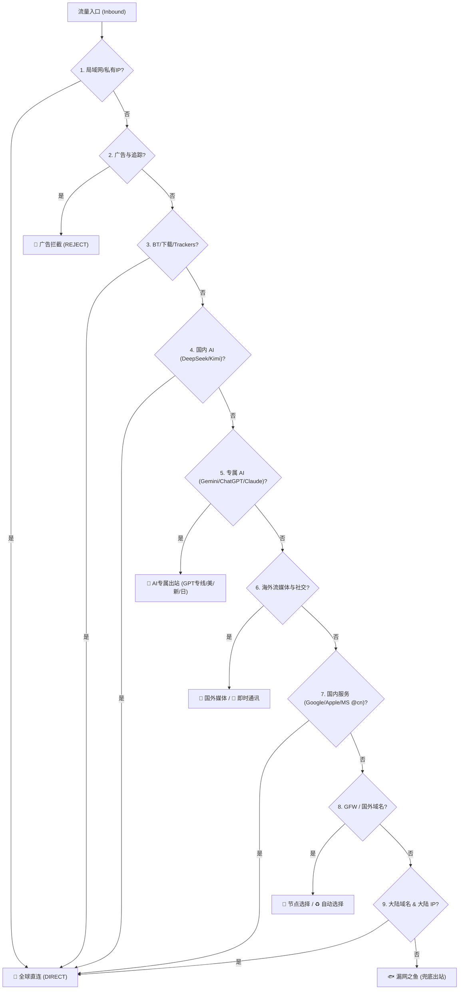

# 🌐 AZhan HomeProxy 分流方案 (基于 DustinWin 规则集)

本项目是专为 **HomeProxy**（基于 `sing-box` 内核的 OpenWrt 插件）量身定制的高性能分流方案。

结合了本项目成熟的分流体系（**16 个国家/地区独立自动测速 + GPT 专线 + Gemini/ChatGPT/Claude 专属 AI 分流 + 国内大模型直连**）与 **[DustinWin/ruleset_geodata](https://github.com/DustinWin/ruleset_geodata)** 每日自动构建的 sing-box 原生二进制规则集（`.srs`），兼具**极速加载、超低内存占用与高精度业务分流**。

---

## 🌟 特性亮点

1. **二进制规则集 (`.srs`) 驱动**：
   - 相比传统文本/yaml 规则，sing-box 原生 `.srs` 二进制规则集体积缩小 80%+，路由器内存占用更低，匹配效率达到微秒级。
   - 数据源每日凌晨 3 点自动构建同步，保障国内外域名与 IP 分流最新。
2. **AI 精准分流与国内 AI 保护**：
   - **Google Gemini**：独立分流，默认优先走美/新/日/台/英优质节点，**避开香港节点**（防止被拒）。
   - **OpenAI ChatGPT / Anthropic Claude**：独立策略匹配，优先接入 GPT 专线与优质解锁节点。
   - **国内大模型（DeepSeek、Kimi、智谱、通义千问等）**：域名级别强制走直连，防误翻墙被封控或劣化速度。
   - **海外通用 AI**：使用 DustinWin `ai.srs` 规则集全量兜底。
3. **三种部署形态全覆盖**：
   - **方式一（极速推荐）**：SSH 终端一条命令一键写入 `/etc/config/homeproxy`（含自动备份），10 秒完成 20+ 规则集与分流策略部署。
   - **方式二（高级定制）**：提供包含 16 国/地区与 GPT 专线自动测速的完整 `singbox_config_template.json`，适用于自定义配置模式。
   - **方式三（图形界面）**：提供清晰的 LuCI Web 界面逐项对照表。
4. **内置 CDN 国内加速**：
   - 默认支持 **jsDelivr CDN** 与 **ghfast.top 镜像**，解决软路由因 GFW 阻断无法拉取 GitHub 原始 Releases 规则的问题。

---

## 🧭 分流层级架构 (Priority Hierarchy)



---

## 🚀 部署指南

### 方式一：OpenWrt 终端一键脚本导入（强烈推荐）

无需在 Web 界面手动点击添加几十条规则，脚本通过 OpenWrt 原生 `uci` 引擎批量写入配置：

1. **上传并执行脚本**：
   使用 SSH 连接到 OpenWrt 路由器（如 `ssh root@192.168.1.1`），执行以下命令：

   ```sh
   # 方式 1.1：直接下载脚本并运行
   curl -fsSL https://raw.githubusercontent.com/iazhan/AZhan_OpenClash_Rules/main/homeproxy/setup_homeproxy.sh -o /tmp/setup_homeproxy.sh && sh /tmp/setup_homeproxy.sh

   # 方式 1.2：若 GitHub 直连困难，可使用 ghfast 镜像：
   curl -fsSL https://ghfast.top/https://raw.githubusercontent.com/iazhan/AZhan_OpenClash_Rules/main/homeproxy/setup_homeproxy.sh -o /tmp/setup_homeproxy.sh && sh /tmp/setup_homeproxy.sh

   # 方式 1.3：使用 jsDelivr CDN 加速（推荐）
   curl -fsSL https://fastly.jsdelivr.net/gh/iazhan/AZhan_OpenClash_Rules@main/homeproxy/setup_homeproxy.sh -o /tmp/setup_homeproxy.sh && sh /tmp/setup_homeproxy.sh
   ```

2. **按提示选择下载源**：
   - 输入 `1`：使用 jsDelivr CDN 加速（推荐，国内路由访问最顺畅）。
   - 输入 `2`：使用 ghfast.top 镜像。
   - 输入 `3`：使用 GitHub 官方源。

3. **脚本会自动完成**：
   - 自动备份现有的 `/etc/config/homeproxy` 到 `/etc/config/homeproxy.bak.xxx`。
   - 写入 20+ 个远程二进制规则集。
   - 按严格优先级写入 16 项路由规则。
   - 重载 HomeProxy 服务生效。

---

### 方式二：sing-box 完整 JSON 模板（适用于自定义配置）

如果你使用 HomeProxy 的 **自定义配置 / 混合配置模式**，或直接作为独立 sing-box 运行：

- 配置文件路径：[homeproxy/singbox_config_template.json](file:///d:/Projects/Codex/AZhan_OpenClash_Rules/homeproxy/singbox_config_template.json)
- **包含特性**：
  1. **16 个国家/地区独立自动测速组**（港、日、新、美、台、韩、英、加、德、法、土、尼、乌、印、越、俄）。
  2. **🤖 GPT专线**（自动匹配包含 `gpt` 关键字的优质节点）。
  3. **🤖 Gemini** 独立出站组（自动避开香港节点）。
  4. 完整的 `rule_set` 与 `rules` 路由配置。

---

### 方式三：LuCI Web 界面手动配置对照表

如需在 OpenWrt 网页后台（**服务 -> HomeProxy -> 客户端设置**）手动核对或调整：

#### 1. 规则集（Rule-sets）配置表

在 **「规则集」** 选项卡中添加以下规则（类型均选 `远程 (Remote)`，格式均选 `二进制 (Binary)`）：

| 标签 (Tag) | 说明 | 推荐下载 URL (jsDelivr 加速) | 更新周期 |
| :--- | :--- | :--- | :--- |
| `ads` | 🛑 广告拦截 | `https://cdn.jsdelivr.net/gh/DustinWin/ruleset_geodata@sing-box-ruleset/ads.srs` | 1d |
| `private` | 🔒 私有域名 | `https://cdn.jsdelivr.net/gh/DustinWin/ruleset_geodata@sing-box-ruleset/private.srs` | 1d |
| `privateip` | 🔒 私有 IP | `https://cdn.jsdelivr.net/gh/DustinWin/ruleset_geodata@sing-box-ruleset/privateip.srs` | 1d |
| `applications` | ⬇️ 直连软件 | `https://cdn.jsdelivr.net/gh/DustinWin/ruleset_geodata@sing-box-ruleset/applications.srs` | 1d |
| `trackerslist` | 📋 BT Trackers | `https://cdn.jsdelivr.net/gh/DustinWin/ruleset_geodata@sing-box-ruleset/trackerslist.srs` | 1d |
| `ai` | 🤖 AI 平台 | `https://cdn.jsdelivr.net/gh/DustinWin/ruleset_geodata@sing-box-ruleset/ai.srs` | 1d |
| `youtube` | 📹 油管视频 | `https://cdn.jsdelivr.net/gh/DustinWin/ruleset_geodata@sing-box-ruleset/youtube.srs` | 1d |
| `netflix` | 🎥 奈飞视频 | `https://cdn.jsdelivr.net/gh/DustinWin/ruleset_geodata@sing-box-ruleset/netflix.srs` | 1d |
| `netflixip` | 🎥 奈飞 IP | `https://cdn.jsdelivr.net/gh/DustinWin/ruleset_geodata@sing-box-ruleset/netflixip.srs` | 1d |
| `disney` | 📽️ 迪士尼+ | `https://cdn.jsdelivr.net/gh/DustinWin/ruleset_geodata@sing-box-ruleset/disney.srs` | 1d |
| `max` | 🎞️ Max | `https://cdn.jsdelivr.net/gh/DustinWin/ruleset_geodata@sing-box-ruleset/max.srs` | 1d |
| `primevideo` | 🎬 Prime Video | `https://cdn.jsdelivr.net/gh/DustinWin/ruleset_geodata@sing-box-ruleset/primevideo.srs` | 1d |
| `appletv` | 🍎 Apple TV+ | `https://cdn.jsdelivr.net/gh/DustinWin/ruleset_geodata@sing-box-ruleset/appletv.srs` | 1d |
| `spotify` | 🎶 Spotify | `https://cdn.jsdelivr.net/gh/DustinWin/ruleset_geodata@sing-box-ruleset/spotify.srs` | 1d |
| `media` | 🌍 国外媒体 | `https://cdn.jsdelivr.net/gh/DustinWin/ruleset_geodata@sing-box-ruleset/media.srs` | 1d |
| `mediaip` | 🌍 国外媒体 IP | `https://cdn.jsdelivr.net/gh/DustinWin/ruleset_geodata@sing-box-ruleset/mediaip.srs` | 1d |
| `tiktok` | 🎵 TikTok | `https://cdn.jsdelivr.net/gh/DustinWin/ruleset_geodata@sing-box-ruleset/tiktok.srs` | 1d |
| `telegramip` | 📲 电报 IP | `https://cdn.jsdelivr.net/gh/DustinWin/ruleset_geodata@sing-box-ruleset/telegramip.srs` | 1d |
| `google-cn` | 🇬 谷歌国内 | `https://cdn.jsdelivr.net/gh/DustinWin/ruleset_geodata@sing-box-ruleset/google-cn.srs` | 1d |
| `apple-cn` | 🍎 苹果国内 | `https://cdn.jsdelivr.net/gh/DustinWin/ruleset_geodata@sing-box-ruleset/apple-cn.srs` | 1d |
| `microsoft-cn` | 🪟 微软国内 | `https://cdn.jsdelivr.net/gh/DustinWin/ruleset_geodata@sing-box-ruleset/microsoft-cn.srs` | 1d |
| `games-cn` | 🎮 游戏国内 | `https://cdn.jsdelivr.net/gh/DustinWin/ruleset_geodata@sing-box-ruleset/games-cn.srs` | 1d |
| `bilibili` | 📺 哔哩哔哩 | `https://cdn.jsdelivr.net/gh/DustinWin/ruleset_geodata@sing-box-ruleset/bilibili.srs` | 1d |
| `games` | 🕹️ 游戏平台 | `https://cdn.jsdelivr.net/gh/DustinWin/ruleset_geodata@sing-box-ruleset/games.srs` | 1d |
| `networktest` | 📈 网络测试 | `https://cdn.jsdelivr.net/gh/DustinWin/ruleset_geodata@sing-box-ruleset/networktest.srs` | 1d |
| `gfw` | 🌎 GFW 域名 | `https://cdn.jsdelivr.net/gh/DustinWin/ruleset_geodata@sing-box-ruleset/gfw.srs` | 1d |
| `proxy` | 🌎 国外域名 | `https://cdn.jsdelivr.net/gh/DustinWin/ruleset_geodata@sing-box-ruleset/proxy.srs` | 1d |
| `tld-proxy` | 🌎 顶级域名 | `https://cdn.jsdelivr.net/gh/DustinWin/ruleset_geodata@sing-box-ruleset/tld-proxy.srs` | 1d |
| `cn` | 🇨🇳 国内域名 | `https://cdn.jsdelivr.net/gh/DustinWin/ruleset_geodata@sing-box-ruleset/cn.srs` | 1d |
| `cnip` | 🀄️ 国内 IP | `https://cdn.jsdelivr.net/gh/DustinWin/ruleset_geodata@sing-box-ruleset/cnip.srs` | 1d |

#### 2. 路由规则（Routing Rules）优先级对照表

在 **「路由规则」** 选项卡中，按以下**自上而下的顺序**添加规则：

| 顺序 | 规则名称 | 匹配内容 (规则集 / 域名) | 出站动作 / 节点 |
| :---: | :--- | :--- | :--- |
| **1** | 私网与局域网直连 | 规则集: `private`, `privateip` | **直连 (DIRECT)** |
| **2** | 广告与隐私拦截 | 规则集: `ads` | **拦截 (REJECT)** |
| **3** | BT与下载直连 | 规则集: `applications`, `trackerslist` | **直连 (DIRECT)** |
| **4** | 国内大模型直连 | 域名后缀: `deepseek.com`, `moonshot.cn`, `kimi.ai`, `zhipuai.cn`, `minimax.chat`, `stepfun.com`, `doubao.com`, `aliyun.com`, `qwen.ai` | **直连 (DIRECT)** |
| **5** | Google Gemini | 域名后缀: `gemini.google.com`, `bard.google.com`, `generativelanguage.googleapis.com`, `aistudio.google.com` | **默认代理 / 美国 / 新加坡** |
| **6** | OpenAI ChatGPT | 域名后缀: `openai.com`, `chatgpt.com`, `oaistatic.com`, `sora.com` | **默认代理 / GPT专线** |
| **7** | Anthropic Claude | 域名后缀: `anthropic.com`, `claude.ai` | **默认代理 / GPT专线** |
| **8** | 海外通用 AI 服务 | 规则集: `ai` | **默认代理** |
| **9** | 海外流媒体与视频 | 规则集: `youtube`, `netflix`, `netflixip`, `disney`, `max`, `primevideo`, `appletv`, `spotify`, `media`, `mediaip` | **默认代理 / 流媒体节点** |
| **10** | 即时通讯与社交 | 规则集: `tiktok`, `telegramip`；域名后缀: `t.me`, `telegram.org`, `twitter.com`, `x.com`, `whatsapp.com` | **默认代理** |
| **11** | GitHub | 域名后缀: `github.com`, `githubassets.com`, `githubusercontent.com` | **默认代理** |
| **12** | 国内服务直连加速 | 规则集: `google-cn`, `apple-cn`, `microsoft-cn`, `games-cn`, `bilibili` | **直连 (DIRECT)** |
| **13** | 游戏平台 | 规则集: `games` | **默认代理** |
| **14** | 网络测速 | 规则集: `networktest` | **直连 (DIRECT)** |
| **15** | GFW与国外域名 | 规则集: `gfw`, `proxy`, `tld-proxy` | **默认代理** |
| **16** | 国内域名与IP直连 | 规则集: `cn`, `cnip` | **直连 (DIRECT)** |

---

## ⚙️ 进阶推荐配置 (Best Practices)

### 1. DNS 设置推荐
在 HomeProxy 的 **「DNS 设置」** 中：
- **国内直连 DNS**：设置为 `223.5.5.5` (阿里 DNS) 或 `119.29.29.29` (腾讯 DNSPod)。
- **国外代理 DNS**：设置为 `https://8.8.8.8/dns-query` (Google DoH) 或 `https://1.1.1.1/dns-query` (Cloudflare DoH)。
- **DNS 分流模式**：选择 **路由 (Route)** 或 **规则分流 (Rule-based)**。

### 2. 阻断 QUIC 协议
在流媒体分流中，YouTube 等客户端默认优先使用 UDP 443 (QUIC) 协议，可能导致分流变慢或测速不准。建议在路由规则顶部添加一条：
- **网络类型**：`UDP`
- **目的端口**：`443`
- **动作**：`拦截 (REJECT)`

### 3. 排错与日志查看
如果配置后无法上网或服务无法启动：
- 在 OpenWrt SSH 终端执行：`logread -e homeproxy` 或 `logread -e sing-box`。
- 检查是否有规则集下载失败（如果是，请在脚本中重新选择 `1 (jsDelivr)` 或 `2 (ghfast)`）。
- 如需一键还原配置：`cp /etc/config/homeproxy.bak.xxx /etc/config/homeproxy && /etc/init.d/homeproxy restart`。
